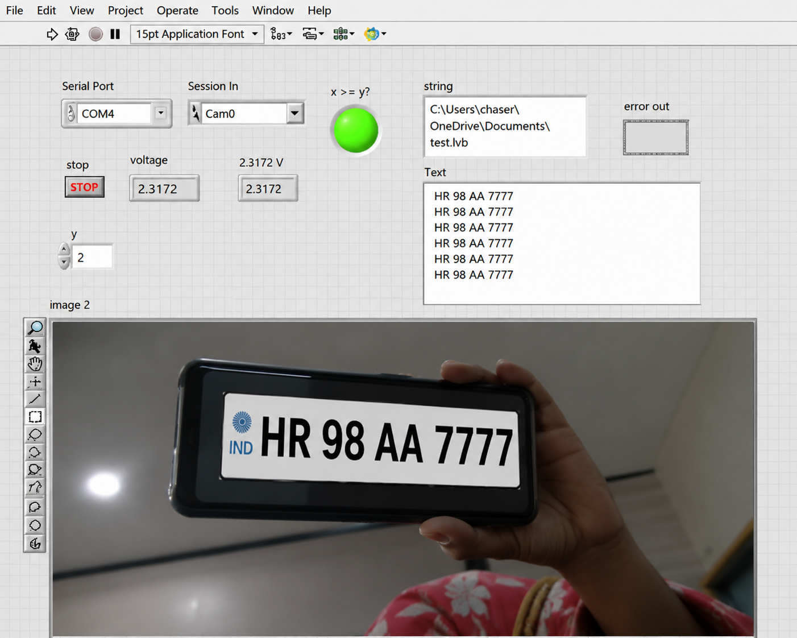
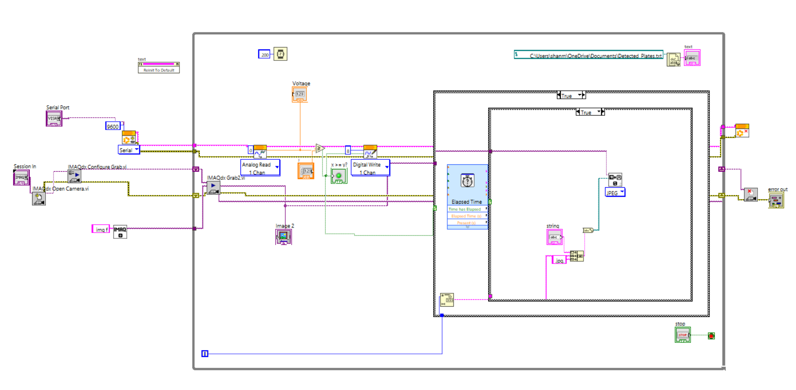

# 🚦 Smart Traffic Alcohol Monitoring with Number Plate Recognition
    


An intelligent traffic monitoring system that detects alcohol consumption using an **MQ-3 Alcohol Sensor** and automatically recognizes vehicle registration numbers using **Optical Character Recognition (OCR)**. The system integrates **LabVIEW**, **Python**, **Arduino Uno**, **OpenCV**, and **Tesseract OCR** to automate the monitoring process and improve road safety.

---

## 📖 Overview

This project is designed to assist traffic police in identifying drivers under the influence of alcohol. The system continuously monitors alcohol concentration using an MQ-3 sensor. When the detected alcohol level exceeds a predefined threshold, a camera automatically captures an image of the vehicle.

The captured image is stored in a designated folder, where a Python script continuously monitors for new images. Once a new image is detected, the script performs **Optical Character Recognition (OCR)** using OpenCV and Tesseract OCR to extract the vehicle registration number. The recognized number is written to a text file, which is continuously read by LabVIEW and displayed on the front panel in real time.

---

## 🎯 Objective

The primary objective of this project is to improve road safety by detecting alcohol consumption and automatically identifying the corresponding vehicle registration number for further action by traffic authorities.

---

## ✨ Features

- 🚦 Real-time alcohol detection using the MQ-3 Alcohol Sensor.
- 📷 Automatic image capture when the alcohol level exceeds the predefined threshold.
- 🚗 Vehicle number plate recognition using Optical Character Recognition (OCR).
- 📝 Automatic extraction of vehicle registration numbers from captured images.
- 💾 Automatic storage of captured images for future reference.
- 🔄 Continuous communication between Python and LabVIEW.
- 📊 Real-time display of recognized vehicle numbers on the LabVIEW front panel.

---

## 🔄 System Workflow

1. The MQ-3 Alcohol Sensor continuously monitors alcohol concentration.
2. Arduino Uno sends the sensor data to LabVIEW.
3. When the alcohol level exceeds the predefined threshold, LabVIEW triggers the camera.
4. The camera captures an image of the approaching vehicle.
5. The captured image is automatically stored in a designated folder.
6. A Python script continuously monitors the folder for newly added images.
7. Python performs Optical Character Recognition (OCR) using OpenCV and Tesseract OCR.
8. The extracted vehicle registration number is written to a text file.
9. LabVIEW continuously reads the text file and displays the recognized vehicle number on the front panel.

---

## 🛠️ Technologies Used

### Hardware

- Arduino Uno
- MQ-3 Alcohol Sensor
- USB Camera

### Software

- LabVIEW
- Python
- OpenCV
- Tesseract OCR

---

## 🏗️ Project Architecture

```text
               MQ-3 Alcohol Sensor
                        │
                        ▼
                  Arduino Uno
                        │
                        ▼
                     LabVIEW
                        │
            Alcohol Level > Threshold?
                        │
                     Yes ▼
                  Capture Image
                        │
                        ▼
              Store Image in Folder
                        │
                        ▼
          Python Folder Monitoring
                        │
                        ▼
          OCR (OpenCV + Tesseract OCR)
                        │
                        ▼
         Extract Vehicle Registration
                        │
                        ▼
          Write Data to Text File
                        │
                        ▼
      LabVIEW Reads File Continuously
                        │
                        ▼
 Display Vehicle Number on Front Panel
```

---

## 📷 Project Demonstration

### LabVIEW Front Panel and block diagram





---

## 📂 Project Structure

```text
Smart-Traffic-Alcohol-Monitoring-with-Number-Plate-Recognition/  
│
├── LabVIEW/
│
├── Python/
│
├── FrontPanelview.jpg
│
├── README.md
│
└── BlockDiagram.png
```

---

## 🚀 Applications

- Smart Traffic Monitoring
- Drunk Driving Detection
- Automatic Number Plate Recognition (ANPR)
- Intelligent Transportation Systems (ITS)
- Automated Law Enforcement
- Road Safety Monitoring

---

## 🔮 Future Improvements

- 📩 Automatic SMS or email notification to traffic authorities.
- ☁️ Cloud database integration for storing violation records.
- 🤖 AI-based vehicle classification.
- 🌐 Integration with smart traffic management systems.
- 📱 Real-time web dashboard for remote monitoring.

---

## 👨‍💻 Author

**Shanmathi G**

Bachelor of Engineering (Electronics and Instrumentation Engineering)

Interested in Full-Stack Development, IoT, Industrial Automation, and Process Control.
